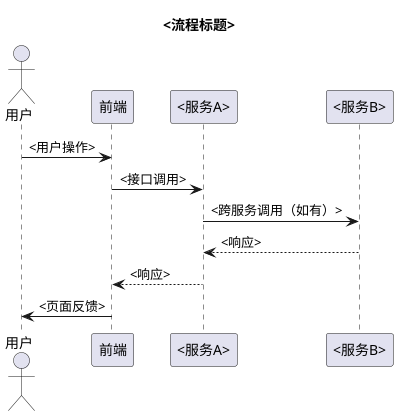

Discuss requirements with the user and output a structured technical design document.

This command produces a `tech-doc.md` that follows the team's Confluence technical document format. It is the **pre-implementation** phase — after the tech doc is finalized, use `/opsx:propose` to generate implementation artifacts (proposal → design → tasks).

**Workflow position**:
```
/opsx:tech-doc  (需求讨论 → 输出技术文档)
       ↓
/opsx:propose   (从技术文档提炼 → proposal/design/tasks)
       ↓
/opsx:apply     (逐任务实施代码)
       ↓
/opsx:archive   (归档)
```

---

**Input**: The argument after `/opsx:tech-doc` is the change name (kebab-case), a requirement description, or a TAPD/Confluence link.

**Steps**

1. **Understand the requirement**

   If no clear requirement is provided, use **AskUserQuestion** (open-ended, no preset options) to ask:
   > "请描述你要做的需求，可以包括：需求背景、TAPD 链接、截图、或关键功能点。"

   From the description, derive a kebab-case change name (e.g., "批量添加资料" → `batch-add-courseware`).

   **IMPORTANT**: Do NOT proceed without understanding what the user wants to build.

2. **Load project context**

   Read the project's OpenSpec config for service context:
   ```bash
   openspec status --json 2>/dev/null; cat openspec/config.yaml
   ```

   This tells you:
   - The service name and responsibilities
   - Tech stack and layering conventions
   - Core domain entities and integrations
   - Whether there are existing active changes

3. **Explore and discuss** (interactive — do NOT rush to output)

   a. **Explore the codebase** — Search for relevant code related to the requirement:
      - Existing Controllers / endpoints that will be new or modified
      - Related Service / Manager layers and their method signatures
      - Domain entities, DTOs, and enums involved
      - Database tables (look at Mapper XML, entity annotations, or DDL files)
      - Existing Feign clients if cross-service calls are needed
      - Existing similar features to follow as patterns

   b. **Discuss with the user** — Use **AskUserQuestion** to clarify, covering:
      - Which modules / services are affected?
      - New API or modification of existing?
      - Database schema changes needed?
      - Cross-service interactions (Feign / MQ)?
      - Key business rules, edge cases, and validation requirements
      - Performance concerns (batch size, pagination, concurrency)

   c. **Surface findings** — Share what you found in the codebase:
      - Existing code patterns to follow (e.g., "现有的 `/teachingModule/add` 单条添加接口可以作为参考")
      - Potential impact points and downstream effects
      - Risks (concurrency, data consistency, N+1, cross-DB)

   **This phase can go back and forth multiple rounds.** Let the user drive the depth of discussion.

4. **Create the change directory** (if not already exists)

   ```bash
   openspec new change "<name>"
   ```

5. **Generate tech-doc.md**

   Write the document to `openspec/changes/<name>/tech-doc.md` using the **Tech Doc Template** below.

   Fill in each section based on the discussion and codebase exploration. Ground every design decision in what you found in the code.

6. **Review with user**

   Present a brief summary of the tech doc's key points:
   - 改动了哪些模块
   - 新增/修改了哪些接口
   - 数据库变更概要

   Ask if any section needs adjustment. Iterate until the user is satisfied.

7. **Next step prompt**

   > "技术文档已完成，位于 `openspec/changes/<name>/tech-doc.md`。
   > 下一步可以运行 `/opsx:propose <name>` 基于此文档生成实施方案（proposal → design → tasks）。"

---

## Tech Doc Template

The output MUST follow this structure. Omit sections that are genuinely not applicable (e.g., no database changes), but include all relevant ones.

```markdown
# <需求标题>

## 一、背景

<为什么要做这个需求，业务动机和上下文>
<TAPD 链接（如有）>

## 二、需求概述

<需求的核心功能描述，1-3 段>

## 三、改动模块梳理

| 模块 | 改动点 | 接口 | 服务 |
|------|--------|------|------|
| <模块名> | <改动描述> | <接口路径（标注新增/修改）> | <服务名> |

## 四、接口设计

### 4.1 <接口名称>（新增/修改）

（参考历史接口：<已有接口路径>）

**接口地址**: `<METHOD> <path>`

**请求方式**: <GET/POST/PUT/DELETE>

#### 入参

| 参数 | 类型 | 是否必传 | 默认值 | 字段含义 |
|------|------|----------|--------|----------|
| | | | | |

> 如有嵌套对象，单独列出子表：

**<NestedObject>（<中文名>）**

| 参数 | 类型 | 是否必传 | 默认值 | 字段含义 |
|------|------|----------|--------|----------|
| | | | | |

#### 出参

| 参数 | 类型 | 是否必传 | 默认值 | 字段含义 |
|------|------|----------|--------|----------|
| | | | | |

> 如有嵌套对象，同样单独列出子表。

#### 请求示例

```json
{}
```

#### 响应示例

```json
{}
```

### 4.2 <下一个接口>...

## 五、时序图



> 时序图面向业务交互，只画用户/前端/服务之间的调用关系。不画服务内部实现（DB、Manager、Mapper 等）。
> 多个独立流程可分多个时序图，每个加标题说明。

## 六、数据库

### 6.1 DDL

```sql
-- <变更描述>
ALTER TABLE `table_name`
ADD COLUMN `column_name` VARCHAR(64) NOT NULL DEFAULT '' COMMENT '<注释>';
```

### 6.2 DML（初始化数据）

```sql
-- <数据初始化描述>
INSERT INTO ...;
```

### 6.3 路由/配置（如需网关路由等）

```sql
-- <配置描述>
INSERT INTO m_gateways ...;
```
```

---

## Template Guidelines

- **改动模块梳理**: List every module touched. One row per distinct change point. Mark APIs as `新增` or `修改`. Service column indicates which microservice owns the change.
- **接口设计**: One subsection per API endpoint. For modified APIs, always reference the existing endpoint path. Include nested object definitions (e.g., `ResourceItem`) as separate parameter tables with a red dot 🔴 marker. Provide realistic request/response JSON examples.
- **时序图**: Use PlantUML `@startuml/@enduml` syntax (NOT Mermaid — Confluence does not render Mermaid). The diagram should focus on **business-level interactions only** — show actors (user, frontend) and services as participants. Do NOT include internal implementation details such as databases, managers, mappers, or RPC internals. Keep it at the level of "frontend calls API, API responds". If comparing before/after flows, use `== section title ==` separators. Multiple independent flows should be separate diagrams with titles.
- **数据库**: Follow the team's DDL conventions:
  - Charset: `utf8mb4`, collation: `utf8mb4_general_ci`
  - NOT NULL fields must have DEFAULT values (VARCHAR → `''`, INT → `'0'`)
  - Unique index prefix: `uniq_`
  - Soft delete: `is_deleted tinyint(1) unsigned NOT NULL DEFAULT '0'`
  - Include gateway routing SQL if new endpoints need gateway registration
- **入参/出参表**: Include all fields with accurate types. For `List<T>` or nested `Object` types, define sub-tables with their own headers.
- **请求/响应示例**: Provide realistic sample JSON that matches the parameter tables.

---

## Guardrails

- **Don't implement** — This command produces documentation only, no code changes. If the user asks to implement, remind them to run `/opsx:propose` then `/opsx:apply`.
- **Don't skip discussion** — The explore and discuss phase (Step 3) is critical. Don't jump straight to output. At minimum, explore the codebase to understand existing patterns.
- **Don't invent from scratch** — Base interface design on existing codebase patterns and the user's actual requirements. Reference existing similar endpoints.
- **Follow DDL conventions** — Always apply the team's database standards (utf8mb4, NOT NULL defaults, uniq_ prefix, etc.).
- **Ground in code** — Always explore the codebase before designing. Cite existing files and patterns you found.
- **Be interactive** — Use AskUserQuestion when assumptions need validation. Don't guess on business rules.
- **Stay service-aware** — Read `openspec/config.yaml` to understand which service you're designing for. Different services have different entities, integrations, and conventions.
- **Consistent with existing APIs** — New endpoints should follow the naming, parameter, and response conventions of existing endpoints in the same service.
